# 東方紅魔郷　～ the Embodiment of Scarlet Devil

<picture>
  <source media="(prefers-color-scheme: dark)" srcset="resources/progress_dark.svg">
  
</picture>

[![Discord][discord-badge]][discord]

[discord]: https://discord.gg/VyGwAjrh9a
[discord-badge]: https://img.shields.io/discord/1147558514840064030?color=%237289DA&logo=discord&logoColor=%23FFFFFF

This project aims to perfectly reconstruct the source code of [Touhou Koumakyou ~ the Embodiment of Scarlet Devil 1.02h](https://en.touhouwiki.net/wiki/Embodiment_of_Scarlet_Devil) by Team Shanghai Alice.

**This project is still highly work in progress and in its early stages.**


## Installation

### Executable

This project requires the original `東方紅魔郷.exe` version 1.02h (9f76483c46256804792399296619c1274363c31cd8f1775fafb55106fb852245)

Copy `東方紅魔郷.exe` to `resources/game.exe`.

### Dependencies

The build system has the following package requirements:

- `python3` >= 3.4
- `msiextract` (On linux/macos only)
- `wine` (on linux/macos only, prefer CrossOver on macOS to avoid possible CL.EXE heap issues)
- `aria2c` (optional, allows for torrent downloads, will automatically install on Windows if selected.)

The rest of the build system is constructed out of Visual Studio 2002 and DirectX 8.0 from the Web Archive.

#### Configure devenv

Run the following script:
```bash
# NOTE: On macOS if you use CrossOver.
# export WINE=<CrossOverPath>/wine
./scripts/create_th06_prefix
```

#### Building

Run the following script:

```
python3 ./scripts/build.py
```

This will automatically generate a ninja build script `build.ninja`, and run
ninja on it.

## Contributing

### Reverse Engineering

You can find an XML export of our Ghidra RE in the companion repository
[th06-re], in the `xml` branch. This repo is updated nightly through
[`scripts/export_ghidra_database.py`], and its history matches the checkin
history from our team's Ghidra Server.

If you wish to help us in our Reverse Engineering effort, please contact
@roblabla on discord so we can give you an account on the Ghidra Server.

### Reimplementation

The easiest way to work on the reimplementation is through the use of
[`objdiff`](https://github.com/encounter/objdiff). Here's how to get started:

1. First, follow the instruction above to get a devenv setup.
1. Copy the original `東方紅魔郷.exe` file (version 1.02h) to the
   `resources/game.exe` folder. This will be used as the source to compare the
   reimplementations against.
1. Download the latest version of objdiff.
1. Run `python3 scripts/export_ghidra_objs.py --import-xml`. This will extract
   from `resources/game.exe` the object files that objdiff can compare against.
1. Finally, run objdiff and open the th06 project.

#### Choosing a function to decompile

The easiest is to look at the `config/stubbed.csv` files. Those are all
functions that are automatically stubbed out. You should pick one of them, open
the associated object file in objdiff, and click on the function of interest.

Then, open the correct `cpp` file, copy/paste the declaration, and start
hacking! It may be useful to take the ghidra decompiler output as a base. You
can find this output in the [th06-re] repository.

# Credits

We would like to extend our thanks to the following individuals for their
invaluable contributions:

- @EstexNT for porting the [`var_order` pragma](scripts/pragma_var_order.cpp) to
  MSVC7.

[th06-re]: https://github.com/happyhavoc/th06-re
