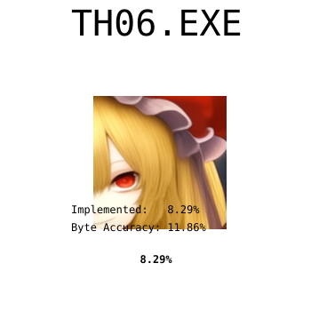

# 東方紅魔郷　～ the Embodiment of Scarlet Devil

<picture>
  <source media="(prefers-color-scheme: dark)" srcset="resources/progress_dark.svg">
  
</picture>

[![Discord][discord-badge]][discord] <- click here to join discord server.

[discord]: https://discord.gg/VyGwAjrh9a
[discord-badge]: https://img.shields.io/discord/1147558514840064030?color=%237289DA&logo=discord&logoColor=%23FFFFFF

This project aims to perfectly reconstruct the source code of [Touhou Koumakyou ~ the Embodiment of Scarlet Devil 1.02h](https://en.touhouwiki.net/wiki/Embodiment_of_Scarlet_Devil) by Team Shanghai Alice.

For a functioning port of the game to other platforms (Linux, modern Windows, etc), see [the portable branch](https://github.com/GensokyoClub/th06/tree/portable)

## Installation

### Executable

This project requires the original `東方紅魔郷.exe` version 1.02h (SHA256 hashsum 9f76483c46256804792399296619c1274363c31cd8f1775fafb55106fb852245, you can check hashsum on windows with command `certutil -hashfile <path-to-your-file> SHA256`.)

Copy `東方紅魔郷.exe` to `resources/th06.exe`.

### Dependencies

The build system has the following package requirements:

- `python3` >= 3.4
- `msiextract` (On linux/macos only)
- `wine` (on linux/macos only, prefer CrossOver on macOS to avoid possible CL.EXE heap issues)
- `aria2c` (optional, allows for torrent downloads, will automatically install on Windows if selected.)

The rest of the build system is constructed out of Visual Studio 2002 and DirectX 8.0 from the Web Archive.

#### Configure devenv

This will download and install compiler, libraries, and other tools.

If you are on windows, and for some reason want to download dependencies manually,
run this command to get the list of files to download:

```
python scripts/create_devenv.py scripts/dls scripts/prefix --no-download
```

But if you want everything to be downloaded automatically, run it like this instead:

```
python scripts/create_devenv.py scripts/dls scripts/prefix
```

And if you want to use torrent to download those dependencies, use this:

```
python scripts/create_devenv.py scripts/dls scripts/prefix --torrent
```

On linux and mac, run the following script:
```bash
# NOTE: On macOS if you use CrossOver.
# export WINE=<CrossOverPath>/wine
./scripts/create_th06_prefix
```

#### Building

Run the following script:

```
python3 ./scripts/build.py
```

This will automatically generate a ninja build script `build.ninja`, and run
ninja on it.

## Contributing

### Reverse Engineering

You can find an XML export of our Ghidra RE in the companion repository
[th06-re], in the `xml` branch. This repo is updated nightly through
[`scripts/export_ghidra_database.py`], and its history matches the checkin
history from our team's Ghidra Server.

If you wish to help us in our Reverse Engineering effort, please contact
@roblabla on discord so we can give you an account on the Ghidra Server.

### Diffing

In order to contribute to the decompilation, you are going to need reccmp
([Instructions](https://github.com/isledecomp/reccmp/tree/master?tab=readme-ov-file#getting-started)).

In the project root, run:

```bash
reccmp-project detect --search-path resources/
```

Build the recompiled executable if you have not done so (see
the above section). Then, in the `build/` directory, run:

```bash
reccmp-project detect --what recompiled
```

To generate a report of the differences between the original and recompiled
binaries, again in the `build/` directory, run:

```bash
reccmp-reccmp --target th06 --html report.html
```

This will display a report of the accuracy to the original binary, and export
this report to a HTML file `report.html`.

# Credits

We would like to extend our thanks to the following individuals for their
invaluable contributions:

- @EstexNT for porting the [`var_order` pragma](scripts/pragma_var_order.cpp) to
  MSVC7.

[th06-re]: https://github.com/happyhavoc/th06-re
